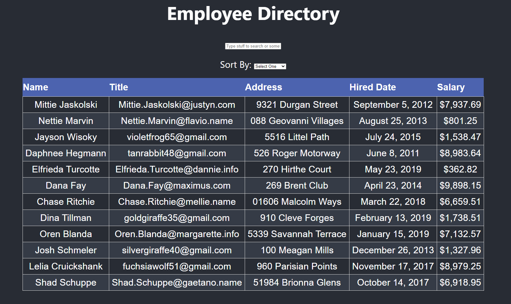

# Employee Directory (React) 

### Project Link

This site is deployed [here](https://mrcartree.github.io/Employee-Directory/) on GitHub Pages.

### Description

This Employee Directory was created using React and React Hooks. The Employee Directory allows the user to FILTER through all the names of the employees and see the results in real time. As well as SORT the items from A - Z or Z - A. This is essentially a showcase of my skills in react when using .filter() and .sort() as well as useState() and useEffect().

### Screenshot

### Challenges

This project proved to be quite the challenge! The hardest thing I had to encounter was learning when to use "useEffect()". Writting the logic for that and making sure everything was working in real time was a big challenge. Also keeping everything organized and knowing where everything is. All in all, I learned a lot from this project and had a fun time getting it all together!

This project was authored by me [Zach LaFleur](https://github.com/MrCartree)